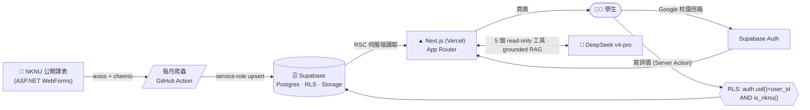
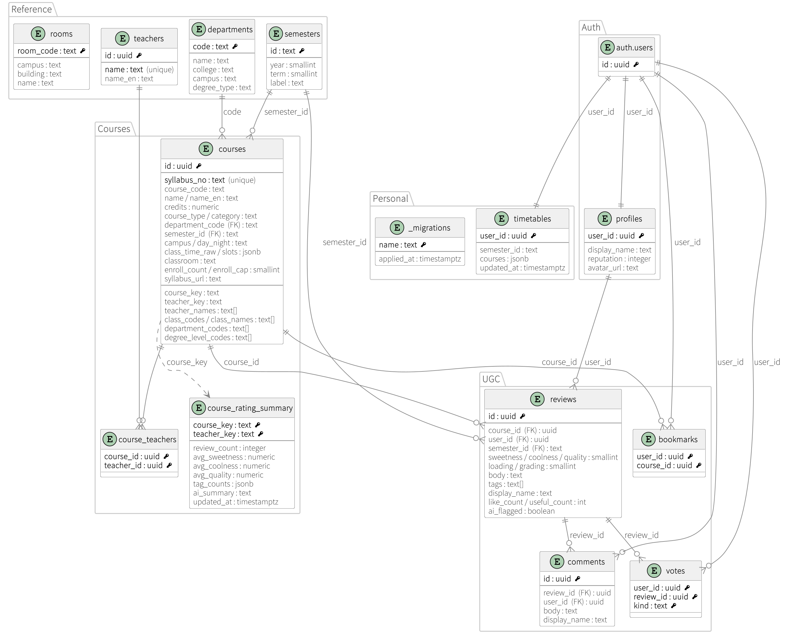

<div align="center">

# 🎓 NKNU 選課評價 · NKNU Course Rating

**高雄師範大學的選課評價 + 排課平台** — 課程爬自學校公開課表,學生以校園 Google 信箱登入後,
針對「每位老師的每門課」寫多維度評價,並用 AI 助手與排課模擬器規劃自己的學期。

[](https://nknu-new-rating-xal6s-projects.vercel.app)
[](https://nextjs.org)
[](https://react.dev)
[](https://www.typescriptlang.org)
[](https://tailwindcss.com)
[](https://supabase.com)
[](./LICENSE)

<a href="https://nknu-new-rating-xal6s-projects.vercel.app"><b>↗ 開啟線上版</b></a>

</div>

> 非官方學生專案。所有課程資料來自學校公開課表,評價由同學自願貢獻。靈感來自 NTU Rating /
> NCKU Hub。

---

## ✨ 功能

| | |
|---|---|
| 📚 **課程瀏覽 / 篩選** | 日夜間 · 學年期 · 校區(和平/燕巢) · 學制 → 系所 → 班級 層層篩選,跟學校開課系統對齊 |
| 🔍 **跨學期搜尋** | 以課名 / 教師 / 課號搜尋,trigram 相似度排名,跨所有學年期 |
| ⭐ **三維度評價** | **甜度 / 涼度 / 收穫**(1–5)+ 修課心得 + 快速標籤(會點名、佛心給分…),可按讚、留言 |
| 👩‍🏫 **每位老師各自評分** | 同一門課不同老師分開呈現;歷年開課(即使課號改了)自動合併成一份紀錄 |
| 🗓️ **排課模擬** | 加課自動偵測衝堂(紅框標示衝突的那一節),**先選學期、鎖學期不鎖學年**(可跨年度排課),分享連結、存到帳號、**下載精美 PNG 課表** |
| 🤖 **AI 課程助手** | 對話式 agent(DeepSeek `v4-pro`),自己呼叫工具查真實課表 —— 找課 / 比較老師 / 課程細節 / 系所年級列課 / 自動排課;grounded RAG、附課程連結、有梗的學長口吻,多層防注入 |
| 🙋 **個人頁** | 首次登入可取名、上傳頭像(顯示在導覽列、個人頁、評價) |
| 🔒 **隱私優先** | 只儲存登入識別碼,**不保存 email**;暗/亮雙主題、單一金色毛玻璃風、手機版 RWD |

## 🧱 技術棧

- **[Next.js 16](https://nextjs.org)**(App Router, Turbopack)+ **React 19** + **TypeScript**
- **[Tailwind v4](https://tailwindcss.com)** + **shadcn/ui**(Nova preset → **Base UI**,非 Radix)+ **Noto Sans TC** —— 深色金色毛玻璃 UI(見 [`DESIGN.md`](./DESIGN.md))
- **[Supabase](https://supabase.com)**(Postgres + Auth + RLS + Storage)—— 資料庫、登入、檔案同一家
- **[Vercel AI SDK v6](https://sdk.vercel.ai)** + **DeepSeek `deepseek-v4-pro`**(tool-calling agent)+ AI Elements
- 爬蟲:Node + axios + cheerio(`scripts/scraper/`)
- 部署於 **[Vercel](https://vercel.com)**

## 🏛️ 架構一句話

> 爬蟲把學校課表灌進 **Supabase**;**Next.js(Vercel)** 在伺服器端讀 Supabase 把網頁吐給使用者;
> 學生用 **Google 校園信箱**登入後,透過 **Server Action** 寫評價,**RLS** 在資料庫層做最後把關
> (本人 + 高師信箱);**DeepSeek** 提供 grounded 的 AI 助手。



### 課程身分模型(重點)

NKNU 的開課代號**不穩定**(會重用、且幾乎每年都換),所以採**兩層識別**:

- **邏輯課程** `course_key = 系所 + 正規化課名 + 老師` → 課程頁 / 評分 / 開課紀錄(跨年合併,即使課號變了)
- **清單**照 `開課代號` 呈現(同學期不同代號各一張卡,跟學校一致),各自連到其邏輯課程
- 一筆開課會掛在多個 班級 / 系所 / 學制,因此成員身分以**陣列**儲存、查詢用陣列包含
- 評分的最小單位是**邏輯課程**(一位老師的版本;合授課視為一個團隊)

<details>
<summary>📐 完整資料庫結構圖(點開)</summary>



> 由 [`docs/schema.puml`](./docs/schema.puml)(PlantUML)產生。

</details>

## 🚀 快速開始

**前置需求**:Node.js 24+、一個 Supabase 專案、(選用)DeepSeek API key。

```bash
# 1. 安裝
git clone https://github.com/xAL6/nknu-course-rating.git
cd nknu-course-rating
npm install

# 2. 設定環境變數
cp .env.example .env.local      # 填入 Supabase URL / keys（見下方）

# 3. 套用資料庫 migration
npm run migrate

# 4. 爬一點課程資料(或先用較小範圍)
npm run crawl -- --year 114

# 5. 開發
npm run dev                     # http://localhost:3000
```

完整安裝(Supabase 專案、Google OAuth、Storage bucket)請見 **[`docs/SETUP.md`](./docs/SETUP.md)**。

### 環境變數

| 變數 | 必填 | 說明 |
|---|:---:|---|
| `NEXT_PUBLIC_SUPABASE_URL` | ✅ | Supabase 專案 URL |
| `NEXT_PUBLIC_SUPABASE_ANON_KEY` | ✅ | 公開 anon key(瀏覽器端;靠 RLS 保護) |
| `SUPABASE_SERVICE_ROLE_KEY` | ✅ | service-role key —— **僅伺服器/爬蟲**,絕不可進瀏覽器 |
| `NEXT_PUBLIC_ALLOWED_EMAIL_DOMAINS` | ✅ | 允許投稿的校園信箱網域(逗號分隔) |
| `DEEPSEEK_API_KEY` | ⬜ | 沒有則 AI 助手顯示「未啟用」 |
| `DEEPSEEK_MODEL` | ⬜ | 覆寫模型,預設 `deepseek-v4-pro` |
| `NEXT_PUBLIC_SITE_URL` | ⬜ | 站台網址(sitemap / OG 用) |

> ⚠️ `.env.local` 已被 `.gitignore` 忽略,**切勿提交真正的金鑰**。`SUPABASE_SERVICE_ROLE_KEY`
> 會略過 RLS,只用於爬蟲與管理腳本。

## 🛠️ 指令

```bash
npm run dev            # 開發伺服器
npm run build          # 正式建置
npm test               # vitest(單元 + Supabase RLS 整合;需要 .env.local)
npx tsc --noEmit       # 型別檢查 app
npx tsc -p tsconfig.scripts.json   # 型別檢查爬蟲/腳本

# 資料管線(需要 .env.local 的 Supabase keys)
npm run migrate                       # 套用 supabase/migrations/*.sql(記錄於 _migrations)
npm run crawl -- --from 110 --to 114  # 全爬(所有 學年/學制/日夜/班級)→ Supabase
npm run crawl:rooms                   # 建立校區對照、回填 courses.campus
npm run seed-reviews                  # 灌示範評價(搞笑暱稱+心得);--purge 一鍵清除
npm run reset-data                    # 清空所有爬下來的課程資料(保留帳號)

vercel deploy --prod --yes            # 部署
```

## 📁 專案結構

```
src/
├─ app/            # Next.js App Router(頁面 + /api 路由)
├─ components/     # UI 元件(course-card, timetable-builder, ai-chat…)
│  └─ ui/          # shadcn / Base UI 原子元件
├─ lib/
│  ├─ data/        # server-only 資料層(courses, reviews, teachers, ai-search…)
│  └─ supabase/    # client(瀏覽器)/ server(RSC)/ admin(service-role)
supabase/migrations/   # 編號、idempotent 的 SQL migration
scripts/scraper/       # NKNU 課表爬蟲(axios + cheerio)
.github/workflows/     # 每月課程爬蟲 Action
docs/SETUP.md          # 完整環境建置指南
```

## 🔐 安全與隱私

- **RLS 是真正的防線**:anon key 是公開的、PostgREST 是公開 HTTP API,所以寫入政策要求
  `auth.uid() = user_id AND is_nknu()` —— `is_nknu()` 讀的是**已驗證的 JWT email**,
  非校園帳號即使繞過前端直連也寫不進去。
- **隱私優先**:只儲存登入 uid,**從不保存使用者 email**。
- **AI 防禦縱深**:前置決定性守門 → 強化 system prompt → 最小權限唯讀工具 → 呼叫上限 → rate limit。
- 回報漏洞請見 **[`SECURITY.md`](./SECURITY.md)**。

## 🤝 貢獻

歡迎 issue 與 PR。送出前請先跑過:

```bash
npx tsc --noEmit && npm run build && npm test
```

- 遵循現有的程式風格與 **Base UI**(非 Radix)慣例:`<Button>` 用 `render={<Link/>}` +
  `nativeButton={false}`,不要用 `asChild`。
- 改動資料庫請新增**編號的 idempotent** migration,不要改既有檔案。
- UI 沿用單一金色 + 毛玻璃方向(見 [`DESIGN.md`](./DESIGN.md)),別引入第二個強調色。

## 📚 文件

- **[`CLAUDE.md`](./CLAUDE.md)** — 完整架構、資料模型、爬蟲、Auth/RLS、資料流(開發者必讀)
- **[`DESIGN.md`](./DESIGN.md)** — 設計系統:金色毛玻璃 token、三層玻璃、ambient、評分色
- **[`docs/SETUP.md`](./docs/SETUP.md)** — 環境建置與營運手冊
- **[`SECURITY.md`](./SECURITY.md)** — 安全模型與漏洞回報

## 📄 授權

[MIT](./LICENSE) © NKNU 選課評價 contributors

<div align="center"><sub>為高師大同學而做 · Built for NKNU students</sub></div>
